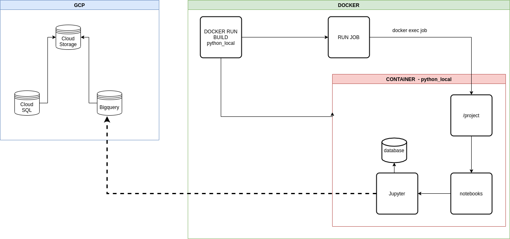

# Ecosystem

Docker environment
```
.
├── images
│   ├── architetura-GTM.png
│   ├── docker_uml.png
│   ├── gtm.png
│   └── pipeline_uml.png
├── scripts
│   ├── buildDocker.sh
│   ├── createContainer.sh
│   ├── enterDocker.sh
│   ├── killDocker.sh
│   ├── logsDocker.sh
│   └── psDocker.sh
├── LICENSE
├── makefile
├── Dockerfile
├── docker-compose.yaml
├── requirements.txt
└── README.md
```

## Instructions for docker

``` sh
    docker build -f Dockerfile -t python_local .  # build dockerfile

    docker run --rm --name job -p 8888:8888 -v $(pwd)/:/project -d python_local:latest # create container mapeando a pasta project

    [windows] docker run --rm --name job -p 8888:888 -v /project -d python_local:latest

    # docker run --rm --name job -p 8888:8888  -d python_local:latest # create container -->
    # utilizando arquivos internos da imagem docker

    docker ps                 # see docker

    docker exec -it job bash  # enter in docker

    docker rm -f job          # kill docker
```
## Instructions for docker-compose

``` sh
    docker-compose up -d          # Creating job

    docker-compose ps             # see docker-compose

    docker-compose logs job       # see job

    docker-compose exec job bash  # To execute docker-compose
```

# Instructions for Makefile

For better use of the Docker see the instructions in the makefile file.

```
        #----------------------------------------------------------------------------#
	# Codes for docker:                                                          #
	#----------------------------------------------------------------------------#
	# + Run make buildDocker
	# + Run make createContainer
	# + Run make createAndBuild --> shortcut for build Docker and Container
	# + Run make logsDocker --> open jupyter notebook
	# + Run make killDocker
	# + Run make psDocker --> see docker
	#----------------------------------------------------------------------------#
	#----------------------------------------------------------------------------#
	# Codes for docker-compose:                                                  #
	#----------------------------------------------------------------------------#
	# + Run make compose-job
	# + Run make compose-ps
	# + Run make compose-logs
	# + Run make compose-stop --> stops the containers
	#----------------------------------------------------------------------------#
	# Done!!!                                                                    #
	#----------------------------------------------------------------------------#
```

# Architecture


